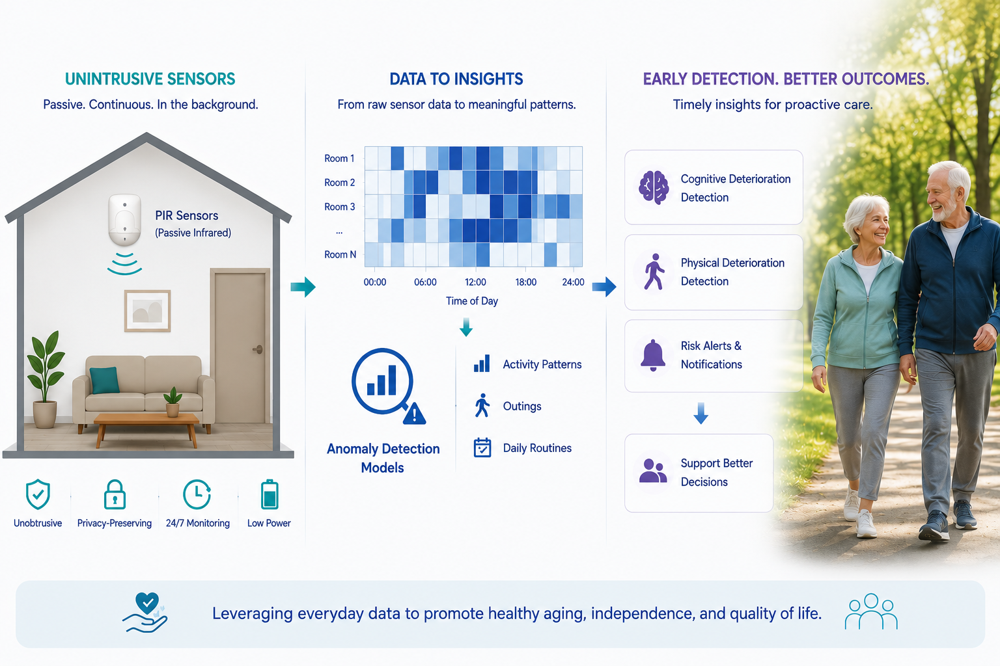

## Modeling and Detecting Cognitive and Physical Deterioration in Seniors from Data Obtained by Unintrusive Sensors – A Pilot Study 
#### Authors: Yueyi Ge, [Ingrid Zukerman](https://research.monash.edu/en/persons/ingrid-zukerman/), and [Mahsa Salehi](https://research.monash.edu/en/persons/mahsa-salehi/)  

This repository contains the python code and resources accompanying the paper.

    
     
    <em>This image is generated by ChatGPT</em>

## Overview

Early detection of cognitive and physical decline is essential for enabling timely interventions that may slow the progression of these conditions and improve quality of life for seniors.

This project presents a personalised anomaly detection framework that analyses behavioural data collected from unintrusive in-home sensors. The approach focuses on identifying deviations from an individual’s habitual behaviour rather than relying on population-wide models.

In particular, the framework estimates two behavioural markers associated with decline:

- **Departures from home**  
  Reduced frequency of outings may indicate cognitive or physical deterioration.

- **Inefficient wandering patterns**  
  Unnecessarily complex locomotion patterns within the home may be associated with cognitive decline.

The proposed methods:
- operate on sparse real-world sensor data,
- do not require house maps or exact sensor placement information,
- are robust to limited data availability,
- and are designed for personalised monitoring of individual users.

Evaluation on a pilot dataset demonstrated promising results, with anomalies being detected prior to clinical assessments diagnosing Mild Cognitive Impairment (MCI) or physical decline.

---

## Repository Structure

.

├── notebooks/          # Jupyter notebooks for models, experiments and analysis

├── data/               # Sample datasets and README on how data can be accessed

└── README.md

---
